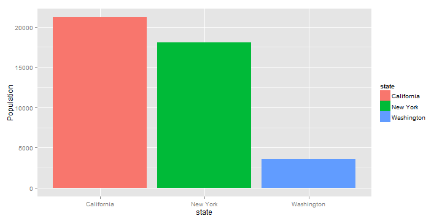

## States Data Comparison

This Application allows the user to compare between different USA states based on :

- Population
- Income
- Illiteracy
- Life Expectancy
- Number of Murders
- Frost
- Area

For more information about the data http://www.inside-r.org/r-doc/datasets/state.x77

---

## Uppload and pre-process data

Steps used to upload and refine the data


```r
library(datasets)
library(ggplot2)
library(shiny)
data(state)
statesData = as.data.frame(state.x77)
statesData$state = rownames(statesData)
statesData$state = as.factor(statesData$state)
statesData$LifeExp = statesData$"Life Exp"
head(statesData,1)
```

```
##         Population Income Illiteracy Life Exp Murder HS Grad Frost  Area
## Alabama       3615   3624        2.1    69.05   15.1    41.3    20 50708
##           state LifeExp
## Alabama Alabama   69.05
```

---

## Comprison Examples

Example 1 : Compare the population between New York, Washington, and California states 


```r
ggplot(data=statesData[statesData$state %in% c("New York","Washington","California"),], 
       aes(x=state, y=Population)) + geom_bar(aes(fill=state),stat="identity")
```

 

---

## Comprison Examples (Continued)

Example 1 : Compare the area between different states 


```r
ggplot(data=statesData[statesData$state %in% c("New York","Washington","California","Florida",
    "Colorado","Virginia"),],aes(x=state, y=Area)) + geom_bar(aes(fill=state),stat="identity")
```

 


